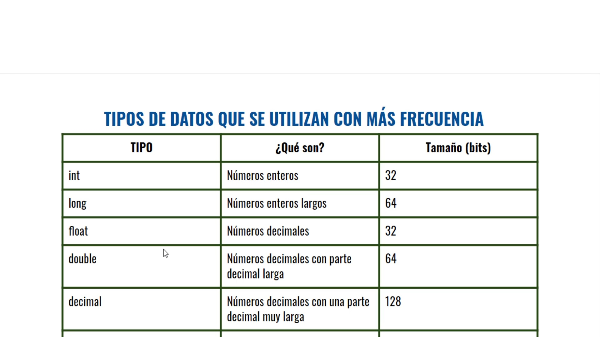

<h2>TIPOS DE DATOS PRIMITIVOS</h2>

Enteros con signo: sbyte, short, int, long
Enteros sin signo: byte, ushort, uint, ushort, uint, ulong

Reales: float, double, decimal

Booleanos: true, false

El tipo de dato "utf16" sirve para codigicar letras o simbolos

